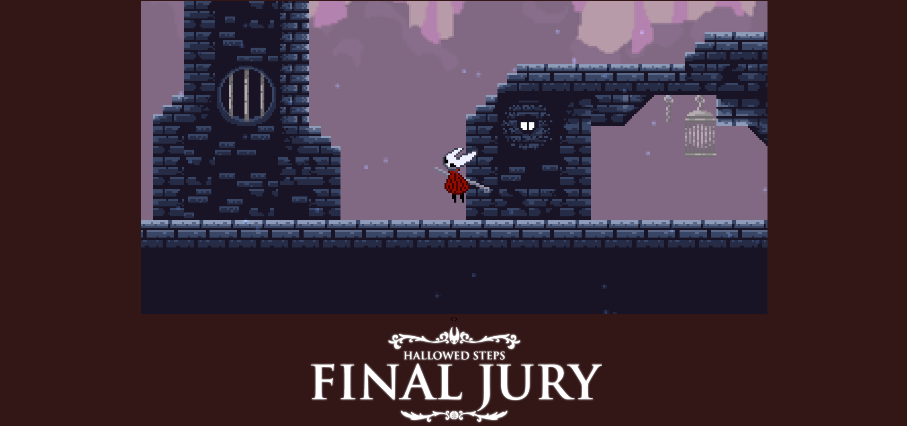
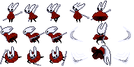
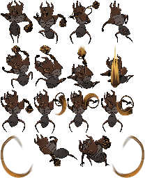
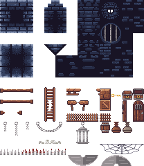
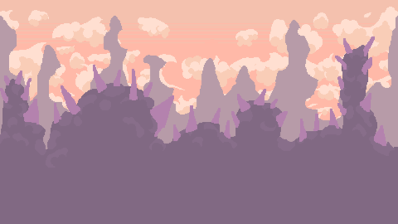

# SongSilk project proposal

## Description

    The game follows the trials and tribulation of the
    player's character: Honnet, as she fights the Final Jury
    on the Hallowed Steps.

## Gameplay

    The player arrives in the Hallowed Steps, after taking a few steps and interacting with the environment, the Final Jury (FJ for short) drops into frame and the boss's title card is shown on screen and then the fight begins.
    The user controls the character with basic WASD controls, spacebar to jump, L to slash, to perform a down slash, th user must look down (S) then slash (L). To bind, the player needs to press K

## Requirements

- player character (Honnet) with basic controls and jump
- player slash attacks (horizontal and downward slashes)
- Animations and sprites for run and slashes with slash effects being done for each
- A map to fight the boss in with distinct collisions (distinguishing background tiles from collidable platforms)
- The actual boss, Final Jury (FJ for short)
- Multiple different attacks that FJ can choose from such:
  - Jump Slam => FJ jumps into the air and falls back down to slam the ground
  - Whip Strike => FJ winds up a strike and whips the area in front of her
  - Fire Charge => FJ dashes forward while dragging her incense burner on the ground
  - Fire Circle Spin => FJ spins her incense burner around, generating rings of fire on the map
- Particles for the fire pillars, fire shockwaves and fire ring
- Possibly a second phase to the boss (Attacks gain extra effects related to fire, such as fire pillars for the dash and the fire shockwave for the slam) (Nice-to-have)
- Boss can get stunned over time after a certain number of hits
- healing for the player with a rudimentary and evolvable silk system with attacks giving silk on hit and losing ALL silk when binding
- UI for masks(health) and silk

# Diagrams

## State Diagrams

### Player (Honnet)

### Final Jury:

## Class Diagram

## Wireframe

### Base Gameplay

# **_ACTUAL GAMEPLAY_**

[Gameplay Video](./assets/designproposalassets/Songsilk-Wireframe.mp4)

### Animation concepts

Spin

Slam

## Assets

### Images

#### Sprite sheet for honnet

#### Sprite atlas for Final Jury

#### Map

### Fonts

for fonts, I'll most likely be using the Trajan Pro font to emulate the writing style used in Hollow Knight and in Silksong

- [Hollow Knight](https://prashantmohta.github.io/TitleGenerator.HollowKnight/?title=5&blur=true&font=1&bold=true&super=Hallowed%20Steps&main=Final%20Jury&) Font Generator
- [Trajan Pro](https://online-fonts.com/fonts/trajan-pro)

### Sounds

For the music, I have used the official OSTs from Silksong (Which I legally bought with the actual game) for the Blasted Steps ambiance and the Last Judge theme.
The sword slash effects were taken from the "Sounds of Pharloom" asset repository for Silksong modding
